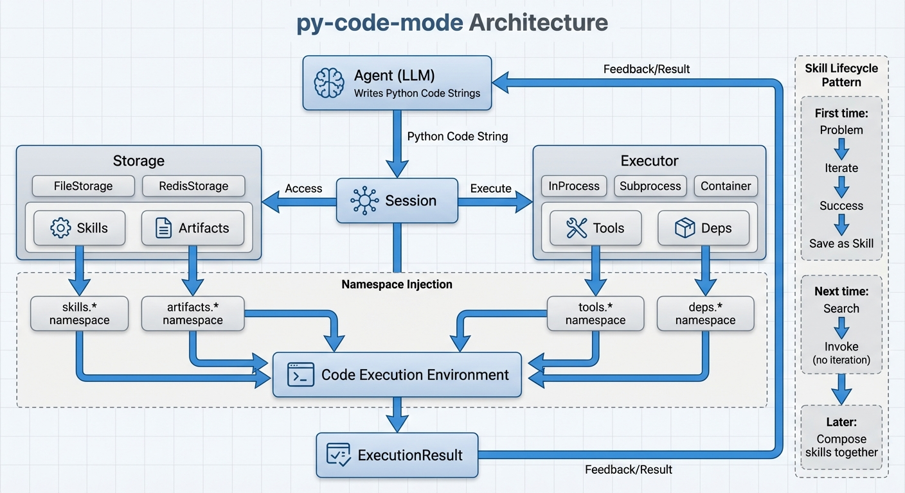

# py-code-mode

[](https://github.com/xpcmdshell/py-code-mode/actions/workflows/ci.yml)
[](https://github.com/xpcmdshell/py-code-mode/tags)
[](https://www.python.org/downloads/)
[](https://opensource.org/licenses/MIT)

Give your AI agents code execution with persistent skills and tool integration.

## The Core Idea

Multi-step agent workflows are fragile. Each step requires a new LLM call that can hallucinate, pick the wrong tool, or lose context.

**py-code-mode takes a different approach:** Agents write Python code. When a workflow succeeds, they save it as a **skill**. Next time they need that capability, they invoke the skill directly—no re-planning required.

```
First time:  Problem → Iterate → Success → Save as Skill
Next time:   Search Skills → Found! → Invoke (no iteration needed)
Later:       Skill A + Skill B → Compose into Skill C
```

Over time, agents build a library of reliable capabilities. Simple skills become building blocks for complex workflows.



## Quick Start

```python
from py_code_mode import Session

# One line setup - auto-discovers tools/, skills/, artifacts/, requirements.txt
async with Session.from_base("./.code-mode") as session:
    result = await session.run('''
# Search for existing skills
results = skills.search("github analysis")

# Or create a new workflow
import json
repo_data = tools.curl.get(url="https://api.github.com/repos/anthropics/anthropic-sdk-python")
parsed = json.loads(repo_data)

# Save successful workflows as skills
skills.create(
    name="fetch_repo_stars",
    source="""def run(owner: str, repo: str) -> int:
    import json
    data = tools.curl.get(url=f"https://api.github.com/repos/{owner}/{repo}")
    return json.loads(data)["stargazers_count"]
    """,
    description="Get GitHub repository star count"
)
''')
```

**Need more control?** Use explicit constructors:

```python
# Process isolation (recommended for untrusted code)
async with Session.subprocess(storage_path="./data", tools_path="./tools") as session:
    ...

# Docker isolation (most secure)
async with Session.container(storage_path="./data", image="my-image") as session:
    ...
```

**Also ships as an MCP server for Claude Code:**

```bash
claude mcp add py-code-mode -- uvx --from git+https://github.com/xpcmdshell/py-code-mode.git@v0.9.0 py-code-mode-mcp
```

## Features

- **Skill persistence** - Save working code as reusable skills, invoke later without re-planning
- **Semantic search** - Find relevant skills and tools by natural language description
- **Tool integration** - Wrap CLI commands, MCP servers, and HTTP APIs as callable functions
- **Process isolation** - SubprocessExecutor runs code in a separate process with clean venv
- **Multiple storage backends** - FileStorage for local dev, RedisStorage for distributed deployments
- **Runtime dependency management** - Install packages on-demand or pre-configure for lockdown

## Four Namespaces

When agents write code, four namespaces are available:

**tools**: CLI commands, MCP servers, and REST APIs wrapped as callable functions
**skills**: Reusable Python workflows with semantic search
**artifacts**: Persistent data storage across sessions
**deps**: Runtime Python package management

```python
# Tools: external capabilities
tools.curl.get(url="https://api.example.com/data")
tools.jq.query(filter=".key", input=json_data)

# Skills: reusable workflows
analysis = skills.invoke("analyze_repo", owner="anthropics", repo="anthropic-sdk-python")

# Skills can build on other skills
def run(repos: list) -> dict:
    summaries = [skills.invoke("analyze_repo", **parse_repo(r)) for r in repos]
    return {"total": len(summaries), "results": summaries}

# Artifacts: persistent storage
artifacts.save("results", data)
cached = artifacts.load("results")

# Deps: runtime package management
deps.add("pandas>=2.0")
deps.list()
```

For programmatic access without code strings, Session also provides facade methods:

```python
# Direct API access (useful for MCP servers, framework integrations)
tools = await session.list_tools()
skills = await session.search_skills("github analysis")
await session.save_artifact("data", {"key": "value"})
```

## Installation

```bash
uv add git+https://github.com/xpcmdshell/py-code-mode.git@v0.9.0
```

For MCP server installation, see [Getting Started](./docs/getting-started.md).

## Documentation

**Getting Started:**
- **[Getting Started](./docs/getting-started.md)** - Installation, first session, basic usage
- **[Session API](./docs/session-api.md)** - Complete Session method reference
- **[CLI Reference](./docs/cli-reference.md)** - MCP server and store CLI commands

**Core Concepts:**
- **[Tools](./docs/tools.md)** - CLI, MCP, and REST API adapters
- **[Skills](./docs/skills.md)** - Creating, composing, and managing workflows
- **[Artifacts](./docs/artifacts.md)** - Persistent data storage patterns
- **[Dependencies](./docs/dependencies.md)** - Managing Python packages

**Deployment:**
- **[Executors](./docs/executors.md)** - Subprocess, Container, InProcess execution
- **[Storage](./docs/storage.md)** - File vs Redis storage backends
- **[Integrations](./docs/integrations.md)** - Framework integration patterns
- **[Production](./docs/production.md)** - Deployment and scaling patterns

**Reference:**
- **[Architecture](./docs/ARCHITECTURE.md)** - System design and separation of concerns

## Examples

- **[minimal/](./examples/minimal/)** - Simple agent implementation (~100 lines)
- **[subprocess/](./examples/subprocess/)** - Process isolation without Docker
- **[deps/](./examples/deps/)** - Dependency management patterns
- **[azure-container-apps/](./examples/azure-container-apps/)** - Production deployment

## License

MIT
