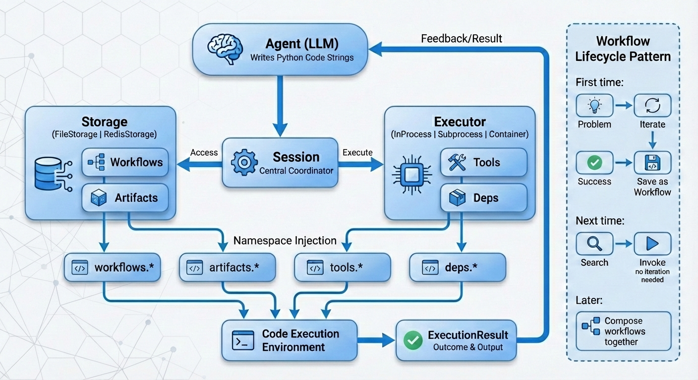

# py-code-mode

[](https://github.com/xpcmdshell/py-code-mode/actions/workflows/ci.yml)
[](https://github.com/xpcmdshell/py-code-mode/tags)
[](https://www.python.org/downloads/)
[](https://opensource.org/licenses/MIT)

## What Is It?

py-code-mode gives an agent a persistent Python execution environment from which it can call registered tools, save data as artifacts to pluggable stores, and save reusable pieces of Python code as named workflows in a persistent library. These workflows can be searched and called again in future runs, even by other agents sharing the same library. This allows a cadre of agents to accumulate institutional capability over time by working in the same (or different) task domains together.

At first run, an agent would search the library for appropriate workflows. If no applicable workflows are found, it would solve the task manually by writing python code to orchestrate tools. Upon encountering a similar task again, the agent could just directly parameterize and invoke the saved workflow.



## Four Namespaces

Inside `run_code`, agents script against four Python namespaces:

- [`tools.*`](./docs/tools.md): Call configured CLI tools, MCP tools, and HTTP/API wrappers as Python functions.
- [`workflows.*`](./docs/workflows.md): Search, call, and compose saved workflows from the shared library.
- [`artifacts.*`](./docs/artifacts.md): Load and save persistent inputs, outputs, and intermediate results.
- [`deps.*`](./docs/dependencies.md): Use installed packages, and inspect or manage runtime dependencies when allowed.

## How Does My Agent Use py-code-mode?

At the framework or MCP layer, the agent can call high-level tools like `search_workflows`, `list_tools`, `create_workflow`, or `run_code`.

Inside `run_code`, those same capabilities are available directly through `tools`, `workflows`, `artifacts`, and `deps`.

Here is the kind of Python an agent writes when it calls `run_code`:

```python
# Load a previously saved input artifact.
services = artifacts.load("service-watchlist.json")

# Use a normal Python package that is already installed in the runtime.
from jinja2 import Template

for service in services:
    # Call a saved workflow from Python.
    packet = workflows.prepare_oncall_handoff(service=service)

    message = Template(
        "Handoff packet ready for {{ service }}. Owner: {{ owner }}. "
        "Needs attention: {{ needs_attention }}."
    ).render(
        service=service,
        owner=packet["owner"],
        needs_attention=packet["needs_attention"],
    )

    # Persist one output artifact per service.
    artifacts.save(
        f"handoffs/{service}.json",
        packet,
        f"Saved on-call handoff packet for {service}",
    )

    # Call a configured tool directly from Python, such as a CLI tool,
    # MCP tool, or HTTP/API wrapper.
    tools.slack.post_message(
        channel="#oncall-handoff",
        text=message,
    )
```

### Workflow Composition

When a repeated job deserves its own name and interface, the agent can package that logic as a new workflow. For example, this workflow turns a single service plus several existing workflows into a reusable on-call handoff packet:

```python
# workflows/prepare_oncall_handoff.py


async def run(service: str) -> dict:
    """
    Build an on-call handoff packet for a single service.
    """

    # Compose several existing workflows into one higher-level handoff packet.
    status = workflows.check_service_status(service=service)
    incidents = workflows.collect_recent_incidents(service=service, limit=5)
    runbook = workflows.get_primary_runbook(service=service)

    return {
        "service": service,
        # Pull in extra context from a directly configured tool.
        "owner": tools.pagerduty.get_primary_oncall(service=service),
        "status": status,
        "recent_incidents": incidents,
        "runbook": runbook,
        "needs_attention": status["state"] != "healthy" or bool(incidents),
    }
```

On later runs, the agent can call `workflows.prepare_oncall_handoff(service="payments")` instead of rebuilding that multi-step reporting flow again.

## How Do I Try It?

There are two main ways to use py-code-mode:

| If you want to...                                                                 | Use...         |
| --------------------------------------------------------------------------------- | -------------- |
| Build your own agent or application in Python, with more control over the runtime | the SDK        |
| Plug py-code-mode into any MCP-capable client, framework, or coding agent         | the MCP server |

### Python SDK

Use the SDK when you are embedding py-code-mode directly into your own app or agent framework and want control over the runtime and how it is exposed.

```bash
uv add git+https://github.com/xpcmdshell/py-code-mode.git@v0.16.1
```

The SDK gives your app orchestration-side methods for tools, workflows, artifacts, and dependencies. These can be wrapped to expose to your agent as tools via your favorite agent framework.

For example, here is a direct AutoGen integration where you expose py-code-mode through explicit framework tools:

```python
from pathlib import Path

from autogen_agentchat.agents import AssistantAgent
from autogen_core.tools import FunctionTool
from autogen_ext.models.anthropic import AnthropicChatCompletionClient

from py_code_mode import FileStorage, Session
from py_code_mode.execution import SubprocessConfig, SubprocessExecutor


storage = FileStorage(base_path=Path("./.code-mode"))
executor = SubprocessExecutor(
    config=SubprocessConfig(tools_path=Path("./.code-mode/tools"))
)
session = Session(storage=storage, executor=executor)

await session.start()


async def run_code(code: str) -> str:
    """Execute Python code in the persistent py-code-mode runtime."""
    result = await session.run(code)
    if result.is_ok:
        return str(result.value) if result.value is not None else result.stdout or "(no output)"
    return f"Error: {result.error}"

search_workflows_tool = FunctionTool(
    session.search_workflows,
    description="Search saved workflows by intent.",
)

list_tools_tool = FunctionTool(
    session.list_tools,
    description="List the available tools.",
)

create_workflow_tool = FunctionTool(
    session.add_workflow,
    description="Create and save a reusable workflow.",
)

run_code_tool = FunctionTool(
    run_code,
    description="Run Python with tools, workflows, artifacts, and deps.",
)

agent = AssistantAgent(
    name="assistant",
    model_client=AnthropicChatCompletionClient(model="claude-sonnet-4-20250514"),
    tools=[search_workflows_tool, list_tools_tool, create_workflow_tool, run_code_tool],
    system_message=(
        "Search workflows first. Use run_code for Python work. "
        "Save reusable solutions with create_workflow."
    ),
    reflect_on_tool_use=True,
    max_tool_iterations=5,
)
```

Inside `run_code`, the agent can also use the injected namespaces `tools`, `workflows`, `artifacts`, and `deps` directly to perform the same operations.

For example, your orchestration code can call `session.list_tools()`, `session.search_workflows()`, `session.save_artifact()`, or `session.add_dep()`. Python code running inside the interpreter can analogously call `tools.list()`, `workflows.search(...)`, `artifacts.save(...)`, or `deps.add(...)`.

If you want explicit control over storage and execution, see [Session API](./docs/session-api.md) and [Executors](./docs/executors.md).

### MCP Server

Use the MCP server when you want the fastest way to plug py-code-mode into an MCP-capable client or framework. Note that this reduces the amount of configurable control you have.

The mcp server can be setup simply with a filesystem backend for tools, workflows, and artifacts like so:

```bash
py-code-mode-mcp --base ~/.code-mode
```

For example, to expose py-code-mode to Claude Code agents, add it to your MCP config like so:

```bash
claude mcp add -s user py-code-mode \
  -- uvx --from git+https://github.com/xpcmdshell/py-code-mode.git@v0.16.1 \
  py-code-mode-mcp --base ~/.code-mode
```

See [Getting Started](./docs/getting-started.md) for the full setup flow.

## Documentation

### Start Here

- [Getting Started](./docs/getting-started.md) - installation, first session, and MCP setup
- [Session API](./docs/session-api.md) - complete `Session` reference
- [CLI Reference](./docs/cli-reference.md) - MCP server and store CLI commands

### Concepts

- [Tools](./docs/tools.md) - CLI, MCP, and HTTP tool adapters
- [Workflows](./docs/workflows.md) - creating, composing, and managing workflows
- [Artifacts](./docs/artifacts.md) - persistent data storage patterns
- [Dependencies](./docs/dependencies.md) - package management

### Deployment

- [Executors](./docs/executors.md) - subprocess, container, and in-process execution
- [Storage](./docs/storage.md) - file and Redis backends
- [Integrations](./docs/integrations.md) - framework integration patterns
- [Production](./docs/production.md) - deployment and scaling patterns
- [Architecture](./docs/ARCHITECTURE.md) - system design and separation of concerns

## Examples

- [minimal/](./examples/minimal/) - simple Claude-powered agent example
- [subprocess/](./examples/subprocess/) - process isolation without Docker
- [deps/](./examples/deps/) - runtime dependency management patterns
- [azure-container-apps/](./examples/azure-container-apps/) - production deployment example

## License

MIT
